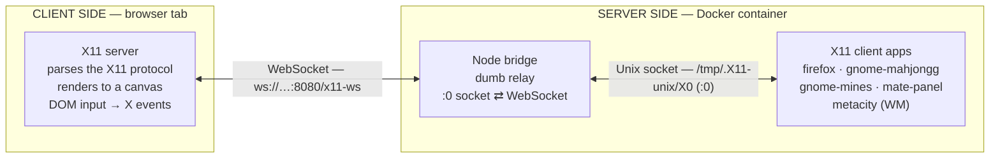

# x11.js

An X11 server that runs in your browser — render real Linux GUI apps to a canvas over WebSocket.

A Node.js bridge (in Docker) exposes a `:0` display on a Unix socket and forwards
raw bytes over WebSocket to a browser tab. The browser implements the actual X
server: it parses the X11 protocol, renders to a `<canvas>`, and turns DOM input
into X events. Real clients — a full MATE desktop, Firefox, GNOME games — don't
know they're talking to a browser.

The bridge is intentionally dumb; all X11 protocol logic lives in `packages/client`.

## Demo

Opening gnome-mines, gnome-mahjongg, and Firefox — every pixel rendered in the browser's `<canvas>`:

https://github.com/user-attachments/assets/4133f75b-4fc1-4a0f-aaab-39b5113d0fff

## How it works

X11 splits into a **server** (the display — it draws windows and reads input) and
**clients** (the apps). x11.js runs the server in your browser and the clients in
Docker, with a dumb bridge relaying the protocol over WebSocket. So the X11 names
end up inverted from where the code actually runs:



The browser is the X11 **server** (the display); the apps are the **clients**,
running in Docker and reaching it through the bridge. Apps connect to the bridge
over a normal Unix socket (`/tmp/.X11-unix/X0`, display `:0`); the bridge forwards
the raw protocol over a WebSocket to the browser, which does the real X server work.

## Documentation

A guided tour — from the first three-line X clients to a full desktop and
Firefox — lives in [`docs/`](docs/README.md):

- [Getting started: xeyes, xclock, xterm](docs/01-getting-started.md)
- [The protocol we had to implement](docs/02-protocol.md)
- [A whole desktop: MATE](docs/03-mate-desktop.md)
- [GNOME games: Mahjongg and Mines](docs/04-games.md)
- [The file manager: Caja](docs/05-file-manager.md)
- [The big one: Firefox](docs/06-firefox.md)

## Layout

```
packages/
  protocol/   shared WS framing (Node + browser)
  server/     Node bridge: Unix socket :0 <-> WebSocket
  client/     Browser X server (Vite)
```

## Run

```sh
# Start the bridge + the apps container
docker compose up --build

# In another terminal, start the browser-side X server
yarn install
yarn dev:client          # http://localhost:8080
```

Open **http://localhost:8080** — that's the only port you need. Vite serves the
page and proxies the X11 WebSocket at `/x11-ws` to the bridge, so the browser
never talks to port 9090 directly.

On connect, the bridge auto-launches a MATE desktop (metacity + mate-panel +
mate-terminal). Override with env vars:

```sh
# Disable autorun
AUTORUN_CMD='' docker compose up

# Launch something else instead of the desktop
AUTORUN_CMD=xterm docker compose up
AUTORUN_CMD=xterm AUTORUN_ARGS='-geometry 100x30 -e /bin/bash' docker compose up
```

Launch additional X clients manually any time:

```sh
docker compose exec apps env DISPLAY=:0 xlogo
docker compose exec apps env DISPLAY=:0 gnome-mahjongg
```

## Status

Implements enough of the X11 core protocol — plus BIG_REQUESTS, RENDER and XKB,
and stubs for XInput2 / RANDR / MIT-SHM / SHAPE — to run a real GTK desktop:

- [x] Handshake, windows, drawing primitives, PutImage
- [x] RENDER: glyphs/text, Composite, Trapezoids, gradients, transforms, ARGB cursors
- [x] Input: keyboard (XKB), pointer, passive/implicit grabs, focus, copy-paste
- [x] Window management: metacity move/resize/raise, EWMH window controls
- [x] Runs: MATE desktop, caja, gnome-mahjongg/mines/tetravex, Firefox

Known gap: the panel window-list applet can't activate windows (a GTK XEmbed
input-routing limitation).
