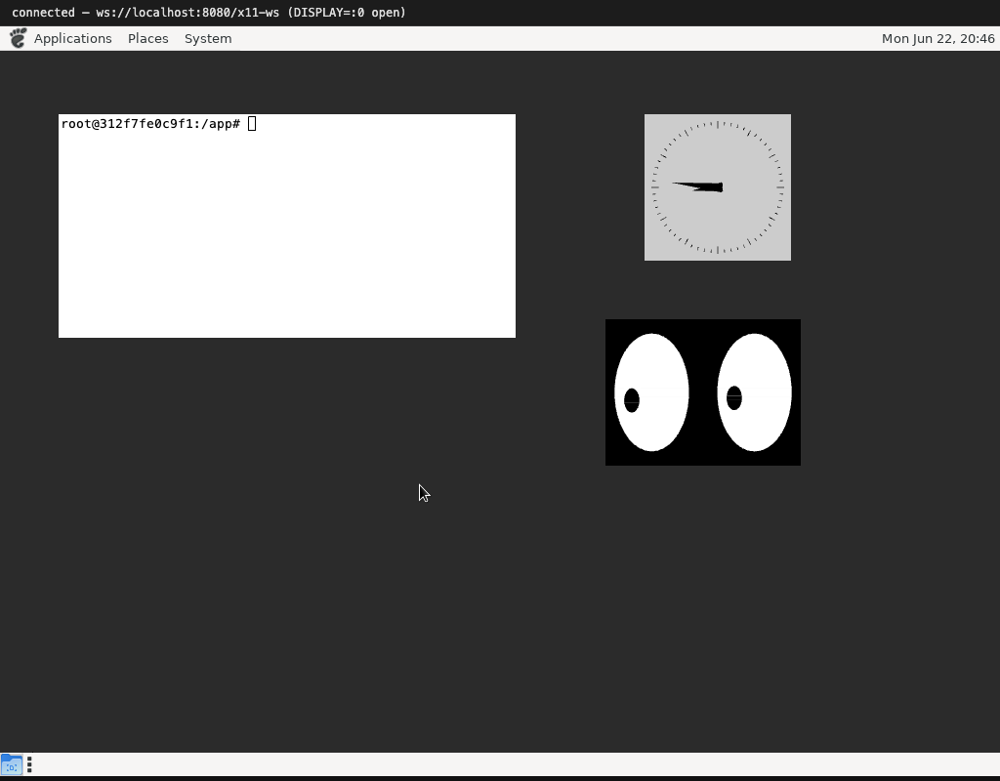

# Getting started: xeyes, xclock, xterm

Before a desktop, before Firefox, there were three tiny programs. They are the
classic "hello world" of X11, and each one is a good first target because each
exercises a different corner of the protocol.

No window manager here — the windows have no title bars, exactly like X11 in
1985. That is on purpose: it is the smallest thing that can possibly work, and it
made the early bugs easy to see.

## What each one tests

**xterm** — a terminal. To draw its prompt it asks the server to render text, so
this is the first real test of fonts. Modern xterm draws glyphs through the
RENDER extension (an `A8` alpha mask per glyph, composited onto the window), and
it reads the keyboard, so getting a visible, typeable prompt means the server
handles glyph rendering *and* key events end to end.

**xclock** — an analog clock. The clock face, the tick marks and the hands are
drawn as filled polygons. xclock sends them as RENDER **trapezoids**, so a
correct clock face means the trapezoid rasterizer works and antialiases its
edges. The second hand also makes the client redraw once a second, which is a
nice steady test that the request/expose loop keeps running.

**xeyes** — two eyes whose pupils follow the pointer. xeyes selects pointer-motion
events on the root window and recomputes the pupils on every move. If the pupils
track the cursor, motion events are flowing with correct coordinates. (xeyes also
uses the SHAPE extension to make its window non-rectangular; we accept the SHAPE
requests as a stub, so the eyes render inside a normal rectangle — good enough.)

## Why start here

X11 is a byte protocol: the client opens a socket, sends a connection-setup
block, and then streams little fixed-layout request packets; the server streams
back replies and events. None of that is human-readable, so the only way to know
you parsed a request correctly is to make a real client draw the right thing.

xeyes, xclock and xterm are perfect for that. They are small, they each lean on a
different feature, and they fail *visibly* — a wrong byte offset shows up as a
clock with no hands or eyes that look the wrong way. Once all three were correct,
the foundation was solid enough to go after a real toolkit.

Next: [the protocol we had to implement](02-protocol.md).
