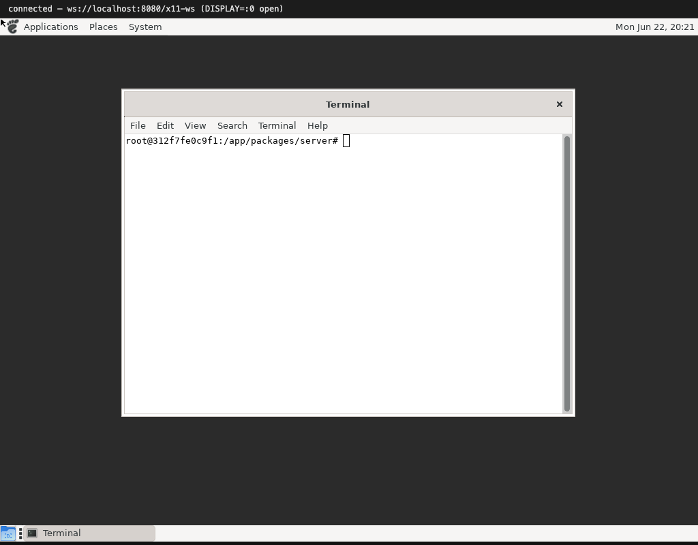

# The protocol we had to implement

X11 is a stream protocol over a socket. A client connects, sends a setup block,
and then the two sides exchange three kinds of message:

- **requests** — client → server ("create a window", "draw text", "give me this
  property"). Most are fire-and-forget; some ask for a **reply**.
- **replies** — server → client, answering a request that wanted one.
- **events** — server → client ("the pointer moved", "this window needs
  repainting", "a key went down").

Every message is a fixed little binary layout — opcodes, 16-bit lengths,
window IDs, packed coordinates. There is no JSON, no text. The browser side is a
parser and a renderer for that byte stream; the [Node bridge](../README.md) just
carries the bytes and understands none of it.

## The core

The foundation is the X11 core protocol: the connection handshake (one screen, a
TrueColor visual), windows and their tree, properties and atoms, the graphics
context, and drawing primitives — lines, rectangles, fills, and `PutImage` for
raw pixels. Add input delivery (key/button/motion events, with the focus and grab
rules that decide *which* window gets each event) and you can already run the
old-school clients from the [previous page](01-getting-started.md).

`BIG_REQUESTS` is in here too — a tiny extension that lets a request exceed the
256 KB the 16-bit length field allows. Toolkits negotiate it immediately on
startup, so without it nothing modern even connects.

## RENDER — where modern apps live

The single most important extension is **RENDER**. Almost everything a GTK app
puts on screen goes through it:

- **Text.** Each glyph is uploaded once as an alpha mask and then composited
  wherever it is needed. All the labels, menus and terminal text you see are
  RENDER glyph composites.
- **Compositing.** `Composite` blends a source picture onto a destination with a
  Porter-Duff operator — this is how icons, themed widgets and translucent edges
  land on the window.
- **Trapezoids and gradients** for antialiased shapes (xclock's face, rounded
  buttons, sliders).
- **Transforms** to scale a source while compositing — used for scaled icons.
- **ARGB cursors**, so the pointer can be a themed image (an I-beam over text, a
  resize arrow on a border) instead of a fixed black arrow.

## Keyboard: XKB

Real toolkits ask for the keyboard map through **XKB** rather than the old core
request. We implement enough of XKB's `GetMap` (key types, symbols, modifier map)
that GTK is happy; getting this subtly wrong was an early blocker that kept whole
apps from starting.

## The stubs

A handful of extensions only need to exist, not work, so that clients probe them
and move on: **XInput2**, **RANDR**, **SHAPE**, and **MIT-SHM**. MIT-SHM is the
interesting one — see the [file-manager page](05-file-manager.md) for why
*not* advertising it is what makes icons appear.

Next: [a whole desktop with MATE](03-mate-desktop.md).
