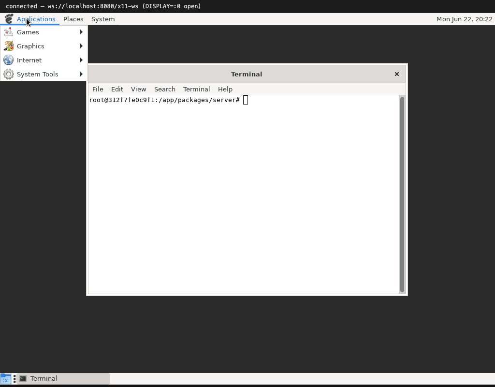

# A whole desktop: MATE

Single windows are one thing; a desktop is another. A desktop means a **window
manager** moving and stacking windows, a **panel** with menus and a clock and a
task list, and apps that expect all of that to be there. x11.js runs **MATE** —
the GNOME 2-lineage desktop — with `metacity` as the window manager.

(Not GNOME Shell: that needs OpenGL/GLX or Wayland, which this server doesn't
provide. MATE is the GNOME-family desktop that runs on a plain X server.)

## The window manager

In X11 the server does **not** move, resize or decorate windows — a separate
client, the window manager, does. metacity asks the server to redirect
substructure events on the root window, so when an app maps a window metacity
gets a chance to wrap it in a title-bar frame and place it.

Making this work meant implementing the pieces metacity leans on:

- **Substructure redirect/notify** so map/configure requests reach the WM.
- **Reparenting** windows into frames.
- **Passive and synchronous pointer grabs** plus `AllowEvents` — this is how
  click-to-focus passes the click through to the app instead of swallowing it.
- **EWMH** messages, so the title-bar buttons (minimize/maximize/close) and
  programmatic window activation work.

The result is what you expect: drag a title bar to move a window, drag a corner
to resize, click to raise and focus. The pointer even changes shape over borders,
thanks to RENDER cursors.

## The panel

`mate-panel` provides the top bar (the Applications/Places/System menus and the
clock) and a bottom bar. The menus are real GTK menus — open one and the server
creates and maps override-redirect popup windows, draws the category icons, and
tracks the pointer to highlight items. Launching an entry runs a real program in
the container.

## A known rough edge

The bottom panel's **window-list** (the task buttons) doesn't activate windows
when clicked. It is an out-of-process XEmbed applet, and GTK doesn't route the
click through to its windowless task buttons in this server — the click arrives
at the applet but goes nowhere. Everything else (the menus, the clock, window
controls, click-to-raise) works; this one applet is the honest gap.

Next: [the GNOME games](04-games.md).
