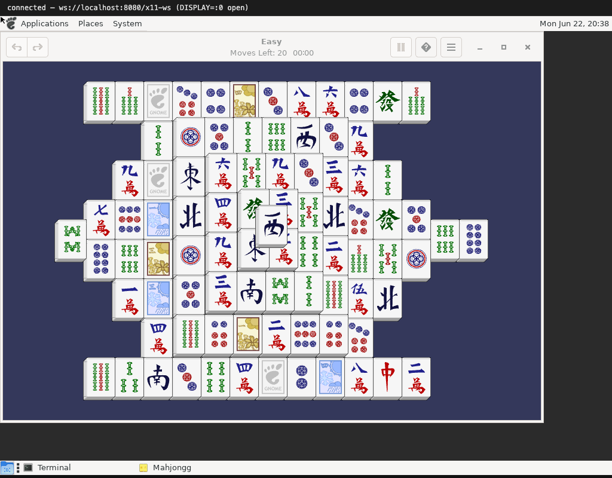
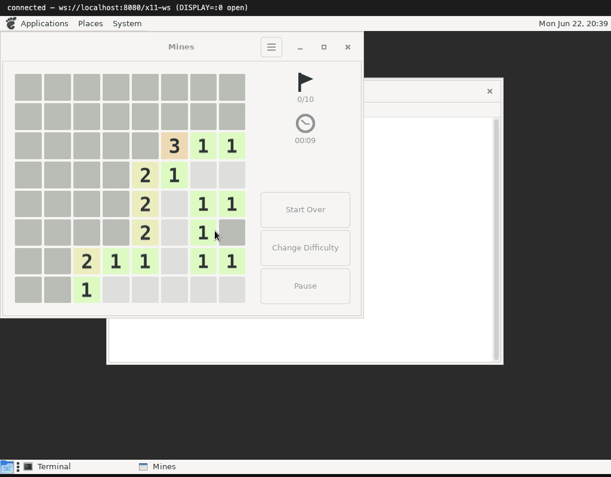

# GNOME games: Mahjongg and Mines

The GNOME games are a great milestone. They are real GTK apps — so they exercise
RENDER, theming and input — but they are also genuinely fun to play, which makes
"does it actually work?" easy to answer: try to win.

## Mahjongg

Every tile is drawn through RENDER — the tile face, the colored symbol, the
beveled edge — and the whole board is composited together. Getting mahjongg to
render correctly turned up a real bug: tiles came out blank because the server
was holding on to a stale clip region from an earlier `ChangePicture`. Honoring
the clip reset (a `CPClipMask` of `None` clears the clip) fixed it, and the tiles
appeared.

Selecting and matching tiles is pure pointer work — press, release, and the grab
rules that decide the click belongs to the tile under it.

## Mines

Mines was where input got serious. The board is a grid of GTK buttons, and the
first attempts revealed cells that never opened — the click was reaching the
window but the button never fired. The fix was a chain of small protocol
correctnesses:

- **Synchronous passive grabs + `AllowEvents(ReplayPointer)`** so metacity's
  click-to-focus grab replays the press to the board instead of eating it.
- A proper **implicit pointer grab** that survives the app calling
  `XUngrabPointer` mid-click (mines does exactly that on every press), with the
  Enter/Leave crossing that GTK needs to dispatch the release.
- Focus tracked at **toplevel** granularity, because mines auto-pauses on
  focus-out and would otherwise reject every click on a "paused" board.

Once those landed, the cells reveal, the numbers render (RENDER glyphs again, in
their per-count colors), and the game is playable start to finish.

Next: [the file manager](05-file-manager.md).
