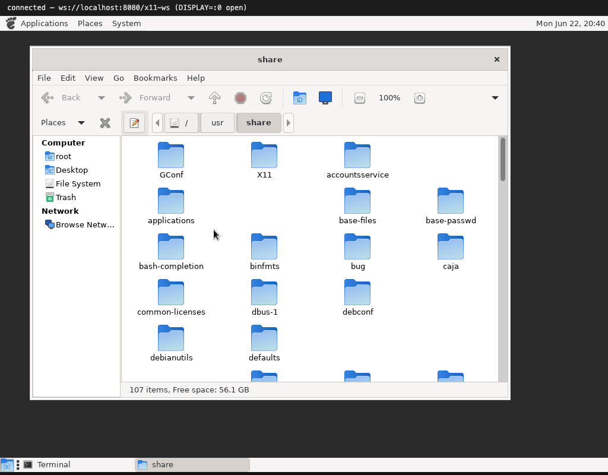

# The file manager: Caja

Caja is MATE's file manager (a fork of Nautilus). It is a good test because it is
a *busy* window — a menu bar, a toolbar with breadcrumbs, a sidebar tree, and a
grid of folder icons — all of it themed GTK.

## Icons, and the shared-memory trick

The folder icons are the interesting part. Icons are loaded from the
`adwaita-icon-theme` (many are SVG, rasterized by `librsvg`), scaled to size, and
composited onto the window with RENDER.

But for a while every icon came out **blank**. The cause was MIT-SHM. GTK prefers
to hand the server image data through shared memory: it writes the pixels into a
shared segment and tells the server "the image is over there, go read it." That
is a great optimization on a normal X server — and impossible here, because the
server is a browser tab with no access to the container's memory. The blank icons
were the server dutifully reading a shared segment it could not see.

The fix is almost funny: **stop advertising MIT-SHM.** When the extension isn't
there, GTK falls back to sending the pixels inline over the socket via the normal
`PutImage` path — which the browser handles fine. The icons appeared immediately.

## Navigation

The rest is ordinary X work paying off: the sidebar and breadcrumb buttons take
clicks, double-clicking a folder navigates into it, and the status bar updates
("107 items, Free space: 56.1 GB"). It behaves like a file manager because, as
far as Caja knows, it is talking to a real X server.

Caja is also why the desktop ships it at all — it backs the panel's **Places**
menu, so "Home", "File System" and the rest open a real browsable window.

Next: [the big one — Firefox](06-firefox.md).
