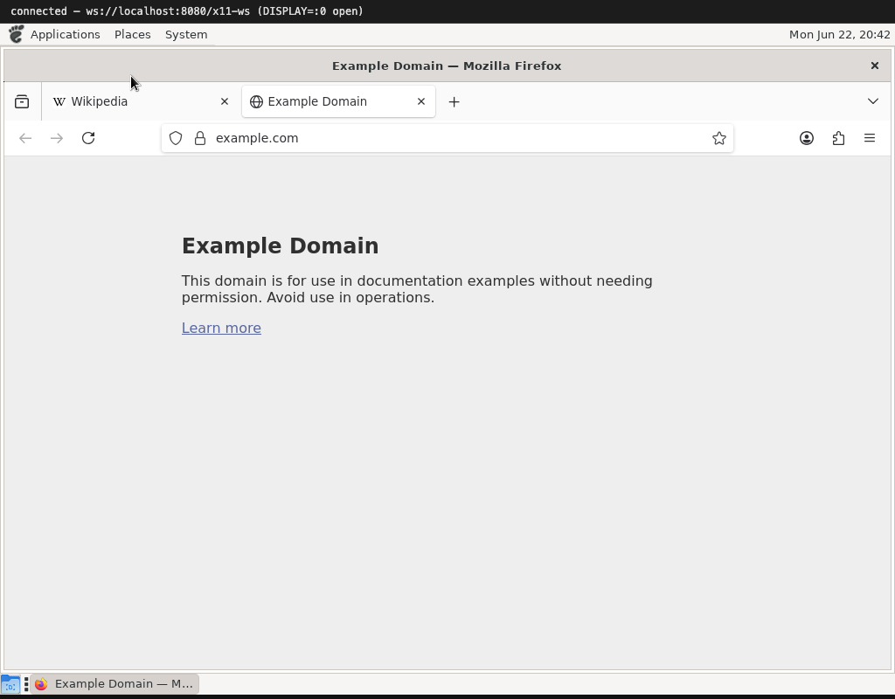

# The big one: Firefox

If a desktop and the games are a good test, Firefox is the boss fight. It is one
of the most demanding X clients there is: multiple processes, a complex
custom-drawn UI, its own compositor, and a hard appetite for graphics
acceleration. Getting it to run end to end is the strongest evidence that enough
of the protocol is real.

And it runs. It opens, shows tabs and the address bar, navigates to a real site
over HTTPS, and renders the page — all drawn into the browser-side `<canvas>`.
The screenshot above is `example.com` loaded over the network and laid out by
Gecko, inside the X server that is itself a browser tab.

## What it takes

- **Multiprocess.** Firefox forks a parent plus content, GPU, RDD and utility
  processes; each opens its own X connection. The server just sees several
  clients at once, which the architecture already handles.
- **Software rendering.** This server has no GLX/EGL, so Firefox is told to skip
  hardware acceleration (one environment variable). It falls back to WebRender's
  software path and draws through the normal RENDER/`PutImage` requests. To make
  the plain `firefox` command "just work", the image wraps it in a one-line script
  that sets those variables.
- **Everything else.** Glyphs for all the text, RENDER compositing for the
  chrome, keyboard input to type a URL, the pointer to click around — Firefox
  leans on every piece the earlier apps built up.

## One gotcha worth knowing

The bridge serves **one** browser tab at a time. Open the page in a second tab
and it takes over the session — the first tab is dropped and the running X
clients (Firefox included) are torn down. It is a deliberate single-viewer
design; just keep it to one tab and Firefox stays happy.

That's the tour: from [three tiny clients](01-getting-started.md) to a real web
browser, all rendered in a browser tab. Back to the [index](README.md).
